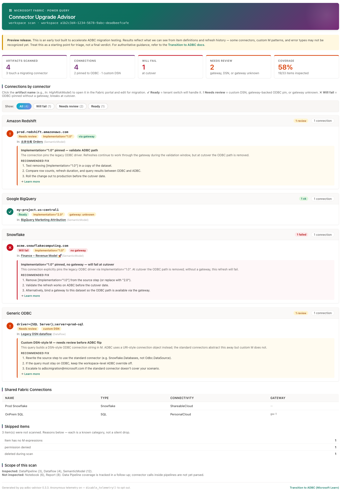

# pq-adbc-advisor

Read-only Fabric notebook that scans a workspace and returns a per-item impact report showing which semantic models, dataflows, and Data Pipelines still pin the legacy ODBC driver as part of the ODBC → ADBC migration for Power Query connectors.

For migration timing and per-connector dates, see the public migration guide: https://aka.ms/adbc-migration.

**This is a starting-point diagnostic, not a final audit.** Connector coverage is expanding, and there are corner cases the standard connectors don't yet map cleanly. Treat the impact report as the first pass to find the bulk of the work; for high-value production reports, validate the ADBC path in a copy of the item before flipping production over.

---

## Sample impact report



---

## What the impact report gives you

- **An inventory of every migrating connector call in the workspace** — Snowflake, Databricks, Google BigQuery, Amazon Redshift, Dremio, Spark / HDInsight Spark, generic ODBC and OLEDB
- **A cutover risk classification per item** — Will fail (pinned to ODBC, no gateway) → Needs review (pinned but gateway-backed, or a custom DSN M query) → Ready (already ADBC, or unpinned so the tenant switch will handle it)
- **A recommended action per row** — remove `[Implementation="1.0"]` from the source step, bind a gateway to this dataset, rewrite the source step to use the standard connector instead of `Odbc.DataSource`, or escalate the corner case
- **Coverage for Data Pipelines and Dataflow Gen2**, not just semantic models — those are the item types customers most often miss when they walk workspaces by hand
- **Resolution tracking across scans** — every scan carries both a first-run baseline and a current-run counter, so a re-scan tells you what's been cleaned up since the first pass

## What it doesn't do

- Rewrite any M expressions
- Trigger refreshes on its own (`validate_migration` is a separate opt-in entry point)
- Send M code, item names, endpoint URLs, credentials, or refresh error message bodies outside the workspace

Every scan sends anonymous counts to the Power Query team so we can measure adoption and prioritize connector coverage — SHA-256-hashed tenant and user identifiers only, no raw values by default. To opt out at any time:

```python
from pq_adbc_advisor import disable_telemetry
disable_telemetry()
```

The opt-out is persisted across kernel restarts.

---

## To use it

1. Download `pq-adbc-advisor-starter.ipynb` from this folder and import it into a Fabric Workspace.
2. Attach the notebook to the workspace you want to inventory.
3. Run the notebook top-to-bottom. It will:
   - `%pip install git+https://github.com/MichaelaIsaacs/pq-adbc-advisor.git@main` into the session (installs the latest bug-bashed v0.3.6 build directly from source; a PyPI release will follow)
   - Call `scan_workspace()`
   - Render the impact report inline
   - Save an HTML copy of the report to the default lakehouse if one is attached
4. Make your fixes.
5. Re-run the scan. The report shows the resolution deltas — how many pins you've cleaned up since your first scan.

## Tenant-wide scans

If you have admin permissions and want to inventory every workspace in the tenant, replace `scan_workspace()` with `scan_tenant()` in the notebook. Tenant scans use the Fabric admin Scanner API and take longer than workspace scans (typically 15–30 minutes for a mid-sized tenant).

## What's covered in this release

- Coverage for Snowflake, Databricks, Google BigQuery, Amazon Redshift, Dremio, Spark / HDInsight Spark, generic ODBC and OLEDB
- Conditional-M detection — both branches of an `if Environment = "prod" then Odbc.Query(...) else Sql.Database(...)` are surfaced
- Dataflow Gen2 refresh history via the Fabric Job Scheduler
- Data Pipeline connector-reference resolution
- Secret redaction on excerpts and endpoint hints (`pwd=`, `Token=`, `AccountKey=`, JWT-shaped tokens)
- Sovereign clouds — GCC, GCC-High, DoD, China
- Anonymous, opt-out telemetry

## Where to file

- **Bugs and feature requests:** https://github.com/microsoft/fabric-toolbox/issues (tag with `pq-adbc-advisor`)
- **Corner cases the tool flags but the standard connector doesn't cover:** adbcmigration@microsoft.com

## Related resources

- Public ADBC migration guide with per-connector dates: https://aka.ms/adbc-migration
- Adoption and remediation dashboard (internal): https://aka.ms/adbcinsights
- Package source and issue tracker: https://github.com/microsoft/fabric-toolbox/tree/main/accelerators/pq-adbc-advisor
